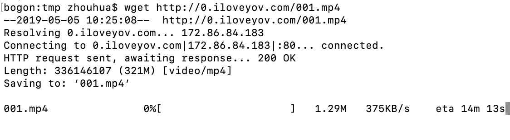
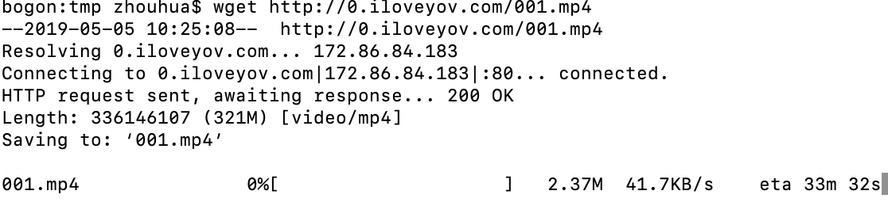
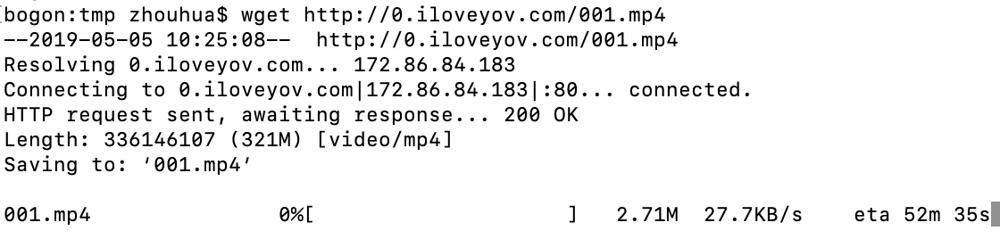
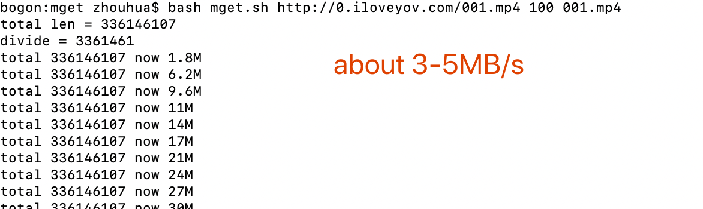

多线程并行下载大文件，突破GFW限速！

由于GFW对国外网站限速，导致下载国外的文件非常缓慢，但GFW仅能对连接限速，而不能对IP限速，因此，只要采用多线程下载一个文件的不同部分，就可以实现高速下载文件。你的带宽有多高，就能下多快。

使用方法:
#### [usage]   sh ./mget.sh url thread_num save_out_file
#### [example] sh ./mget.sh http://xxxxxx.mp4 20 target.mp4

as GFW or some server have speed limit for connection,but not for host.
so we can archive a multi thread downloader to get different part of a big file,then we merge it.

mainly use the Content-Range feature of HTTP

#### example:
 first,the GFW will let you download at a high speed.
 
 
 then, it will be slow

 
 at last, turns to about 20-40 kBps until the end.

 
 while you use the mget. if you want better speed,you just add the thread number.
 if your ISP support 20MB/s then you should use 500-1000 threads to download the file.
 
 

if this project helps you, pls give me a star.

老铁，点个赞呗！

### changelog.
2020-03-07  
增加重新下载功能：由于许多连接会失败，许多连接下载到最后会速度为0，此时超过3秒没有下载到1M的话，就会全部重新下载.  
自动检查所有下载的部分是否完整，如果不完整，就会重新下载.  
速度很慢的时候，会重新启动下载，让整个过程保持高速。      

